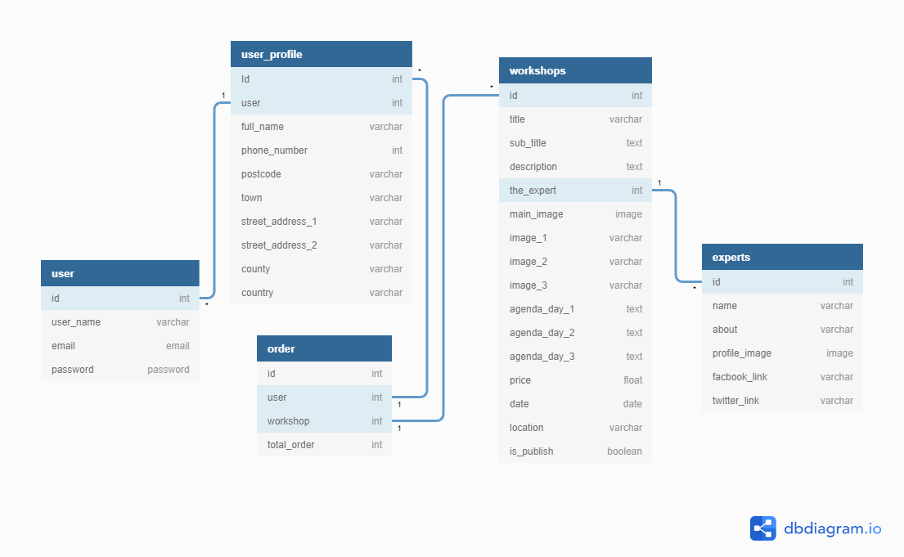

# [Cuisinier-Academy](https://cuisinier-academy.herokuapp.com/)
## Table of Contents
1. [Overview](#overview)
2. [UX/UI](#ux)
    - [Project Goals](#project-goals)
    - [User stories](#user-stories)
    - [Design choices](#design-choices)
    - [Wirframe](#wirframe)
3. [Information Architecture](#information-architecture)
    - [Database](#database)
    - [Applications](#applications)
4. [Features](#features)
5. [Technologies Used](#technologies-used)
6. [Testing](#testing)
    - [User Story Testing](#user-story-testing)
    - [Manual Testing](#manual-testing)
    - [Code Validation](#code-validation)
7. [Deployment](#deployment)

8. [Credits](#credit)

## Overview
Cuisinier Academy Is a Training Provider specialize in Food Making hands-on workshops.

With the top experts in the food Industry , Cuisinier Academy provide 3 days workshops thats take the skills level of participants from beginner to experts .
Either a Foodi , or an entrepreneur or trying to discover the depth of Food making Cuisinier Academy is the place to go .

Cuisinier Academy Website show the available workshops & Experts details ,
By visiting the workshop page you will learn about the workshop details like agenda , location & price
and you will be able to register in the class and make the payment.

Feel Free to visit 
[Cuisinier-Academy](https://cuisinier-academy.herokuapp.com/) Live Website 

## UX

### Project Goals
- Development Goals:

Cuisinier Academy Is a Demo website built as a milestone 4 project for Coding Institute to demonstrate my coding knowledge as a Full stack web developer.
The goal of the website is to solve a Business need for the client help them sell and collect payment from the website along with other goals.

- Business Goals

The Cuisinier Academy managers require a website with nice user experience thats represent the company brand , help the users to learn about the workshops details and who is our experts and what is the available workshops with more details of each workshop.
Also , the ability of the users to register for the workshop and make the payment .
For the website admin , They need the ability to track registration and add or remove workshops. 

- visitors goals

For website users , They know about the company & the available workshops
They need easy navigation through the website and be able to make secure payment with their profile details

### User stories

- Users

| Status | As a... | I would like to be able to... | So that I may...|
| ---- | ------- | ----------------------------- | --------------- |
|&checkmark;| user | I would like to Have a nice user experience , responsive ,rich media , simple navbar | for better UX/UI  |
|&checkmark;| user | I would like to Have Easy navigate through website | So i can understand what this website provide |
|&checkmark;| user | I would like to view a list of available workshops | So i can find workshops best for me |
|&checkmark;| user | I would like to View the trainers and their details | So i can have confedance of the training |
|&checkmark;| user | I would like Learn about the company | So i can make sure of the quality of the products |
|&checkmark;| user | I would like view workshop details , agenda , trainer, date , location , price| So i can make dicide ifi will book|
|&checkmark;| user | I would like to register for an account using my email| to keep my orders history |
|&checkmark;| user | I would like to register for an account using my google account| for easy access |
|&checkmark;| user | I would like to login or logout easy| for easy access |
|&checkmark;| user | I would like to reset my password | for security reasons |
|&checkmark;| user | I would like to rcieve eamils to confirm my actions in my account | for security reasons |
|&checkmark;| user | I would like to have a user profile, with my orders history | to track my regestrations and payments |
|&checkmark;| user | I would like to Easy book my seat with my account info | save time of filling the form |
|&checkmark;| user | I would like to view my order details / cost  before buy| make sure of the details |
|&checkmark;| user | I would like to order in Secure, easy to fill form | easy booking |
|&checkmark;| user | I would like to view an order confirmation  , Thanks page after checkout | booking confirmation |
|&checkmark;| user | I would like to receive an email confirmation after checking out | booking confirmation  |

- Admin

| Status | As a... | I would like to be able to... | So that I may...|
| ---- | ------- | ----------------------------- | --------------- |
|&checkmark;| Admin | I would like to Have a super user account | To access dashboard and manage the site  |
|&checkmark;| Admin | I would like to be able to add workshop and workshop details | To achive the website goal of selling workshops seats |
|&checkmark;| Admin | I would like to be able to edit workshop details | To change and update workshop details |
|&checkmark;| Admin | I would like to be able to delete workshops or make it un published | To manage our schedule and prevent booking outdated workshops |
|&checkmark;| Admin | I would like to be able to add trainers and create trainers profile with their info | To provide more details on our workshops trainer |
|&checkmark;| Admin | I would like to be able to edit trainer details | To manage any changes in trainers info |
|&checkmark;| Admin | I would like to be able to delete trainer profiles | To manage any changes in our trainers and workshops schedule |
|&checkmark;| Admin | I would like to be able to View workshops registration | To manage workshops regestration & sales |
|&checkmark;| Admin | I would like verification emails for new account to be sent | To prevent bots and fake account |
|&checkmark;| Admin | I would like confirmation emails for new orders to be sent | To give our customers record of regestration |

### Design choices

The main theme of the design is to be Dark & Clean with rich media views
The website will provide the same user experiance in diffrent screem sizes
##### Color Scheme

##### Typography

From Google fonts I picked the following fonts:

- Flamenco
- Lato

### wirframe
In the beginig of the project the wireframes were created using [Balsamiq](https://balsamiq.com/)
here are the links :

- [Home Desktop](https://i.ibb.co/R3sZb4x/home-desktop.png)
- [Home Tablet](https://i.ibb.co/r0fjVgf/home-tablet.png)
- [Home Mobile](https://i.ibb.co/3zC1KNK/home-mobile.png)

- [Workshops Desktop](https://i.ibb.co/4fJs163/workshop-desktop.png)
- [Workshops Tablet](https://i.ibb.co/s624F6R/workshop-mobile.png)
- [Workshops Mobile](https://i.ibb.co/5T5VMgJ/workshop-tablet.png)

## Information Architecture

### Database

### Main Applications
- Experts
- home
- reservations
- profiles
- workshops

## Features
- Existing Features

- Features for Future

## Technologies Used

## Testing
### User Story Testing
### Manual Testing
### Code Validation

## Deployment

## Credit

#### Content 
#### Media 
#### Acknowlegements 
